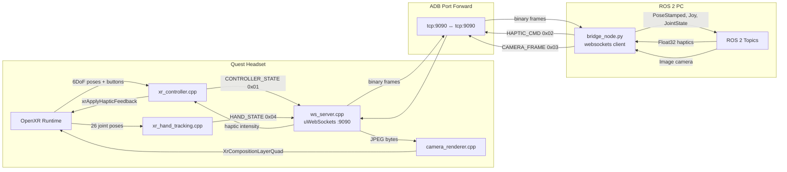

# System Architecture

quest_ros2_bridge is a bidirectional bridge between Meta Quest headsets and ROS 2. The Quest runs a native OpenXR C++ app with an embedded WebSocket server. A Python ROS 2 node on the PC connects as a WebSocket client over ADB port forwarding.

## Components

| Component | Language | Runs On | Role |
|---|---|---|---|
| Android app | C++17 / Kotlin | Quest headset | OpenXR input, rendering, WS server |
| Bridge node | Python 3.10+ | ROS 2 PC | WS client, ROS 2 pub/sub |
| Protocol | Python + C++ | Both | Shared binary wire format |

## Data Flow

## Threading Model

### Android (C++)

| Thread | Responsibility |
|---|---|
| Main (JNI) | Spawns render thread |
| Render thread | OpenXR frame loop, GL context, controller/hand polling |
| WS thread | uWebSockets event loop, message dispatch |

**Cross-thread communication:**
- **Render → WS:** `uWS::Loop::defer()` queues sends on the WS event loop. See [[wire_protocol]] for message formats.
- **WS → Render:** `std::atomic<float>` for haptics, `std::mutex` + staging buffer for camera frames.

### Python (bridge_node.py)

| Thread | Responsibility |
|---|---|
| Main thread | asyncio event loop — WebSocket I/O |
| Spin thread | `rclpy.spin()` — ROS 2 callbacks |

**Cross-thread communication:** ROS 2 callbacks use `loop.call_soon_threadsafe(queue.put_nowait, frame)` to safely enqueue messages for the asyncio send loop. See [[camera_panel]] for the thread safety bug this solved.

## OpenXR Extensions

| Extension | Required | Purpose |
|---|---|---|
| `XR_KHR_android_create_instance` | Yes | Android platform init |
| `XR_KHR_opengl_es_enable` | Yes | OpenGL ES graphics binding |
| `XR_EXT_hand_tracking` | No | 26-joint hand poses |
| `XR_KHR_composition_layer_depth` | No | Depth layer (future) |
| `XR_FB_passthrough` | No | Passthrough (future) |

Optional extensions are requested gracefully — the app continues without them if unavailable.

## Related Docs

- [[wire_protocol]] — binary message format details
- [[android_build]] — build environment and dependencies
- [[ros2_setup]] — ROS 2 workspace and topic reference
- [[camera_panel]] — camera pipeline deep dive
- [[hardware_testing]] — diagnostic tooling and coordinate system
