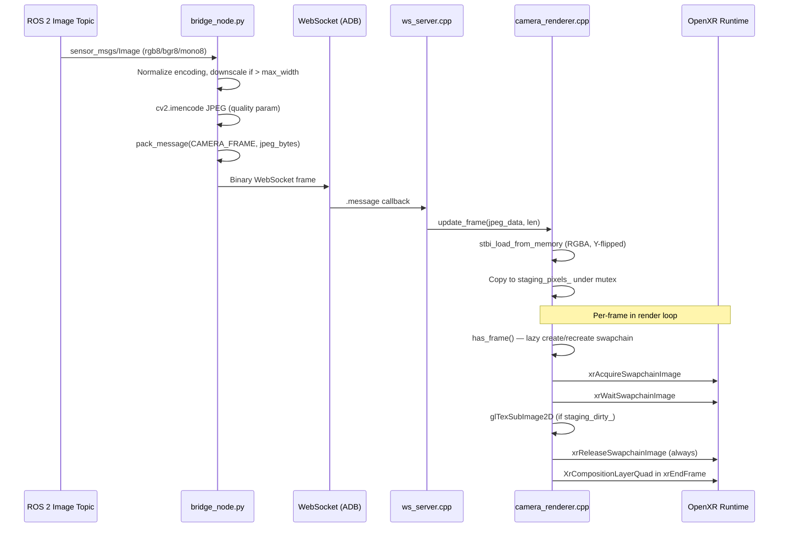

# Camera Panel — Pipeline & Bug History

This document traces the camera panel feature from design through eight bugs found during hardware testing. It's the most complex feature in the project and the one with the most hard-won institutional knowledge.

## Pipeline Overview



## Architecture Decisions

### Why JPEG over raw pixels
- 320×240 RGB = 230KB per frame; JPEG at quality 80 ≈ 15KB
- WebSocket over ADB USB has limited bandwidth
- stb_image.h decoding on Quest is fast enough at 10 Hz

### Why XrCompositionLayerQuad
- Correct OpenXR primitive for a world-fixed flat panel
- Rendered by the compositor, not the app's GL pipeline
- Avoids texture-in-scene rendering complexity

### Why a dedicated swapchain
- OpenXR requires every composition layer to reference a swapchain
- Cannot use a raw `GL_TEXTURE_2D` — the runtime rejects it
- Created lazily on first frame (dimensions unknown until JPEG arrives)

## The Eight Bugs

### Bug 1: `get_quad_layer` returned `false` unconditionally

**Symptom:** Swapchain created, frames uploaded, but no panel visible.
**Root cause:** `camera_renderer.cpp:get_quad_layer()` had `return false;` on line 125 with a `// TODO` comment. The layer struct was fully populated but never submitted.
**Fix:** Changed to `return true;`.

### Bug 2: `layer.subImage.swapchain` was `XR_NULL_HANDLE`

**Symptom:** Would have caused runtime rejection even with `return true`.
**Root cause:** The original scaffold used a raw `GL_TEXTURE_2D` without a swapchain. The `subImage.swapchain` field was never set.
**Fix:** Created a dedicated `XrSwapchain`, set `layer.subImage.swapchain`, `.imageRect`, and `.imageArrayIndex`.

### Bug 3: Swapchain acquire/release timing

**Symptom:** Panel visible intermittently, then disappeared. Runtime errors in logcat.
**Root cause:** `has_frame()` only called `xrAcquireSwapchainImage`/`xrReleaseSwapchainImage` when `staging_dirty_` was true. On non-dirty frames, the swapchain was referenced in `xrEndFrame` without an acquire/release cycle that frame. OpenXR requires a complete acquire/release for every swapchain referenced in every frame's `xrEndFrame`.
**Fix:** Moved acquire/release into `get_quad_layer()` so it runs every frame the layer is submitted. Upload is still conditional on dirty flag. Release is unconditional.

### Bug 4: Panel behind the user

**Symptom:** Panel at Z=-2 was invisible from the user's perspective.
**Root cause:** Quest STAGE space has +Z as the user's forward direction (the direction they faced during guardian setup), not -Z as in standard OpenXR right-hand convention. The comment said "2m forward" but the position was `{0, 1.5, -2.0}` — 2m behind the user.
**Fix:** Changed position to `{0, 1.5, +2.0}`.

### Bug 5: Panel invisible after Z fix (facing away)

**Symptom:** Moving the panel to Z=+2 made it completely invisible again.
**Root cause:** The quad's default normal points along +Z. At position Z=+2 with identity orientation, the quad faces away from the user (the user sees the back face, which is culled). Bisected by reverting Z to -2 — panel reappeared behind user, confirming the Z change was the cause.
**Fix:** Added 180° yaw rotation: `orientation = {0, 1, 0, 0}` (unit quaternion for 180° around Y). This rotates the quad to face back toward the user.

### Bug 6: Image upside down

**Symptom:** Panel visible and correctly positioned, but image was flipped vertically.
**Root cause:** stb_image decodes with Y=0 at top (image convention). OpenGL textures have Y=0 at bottom. Pixels uploaded without flipping.
**Fix:** Added `stbi_set_flip_vertically_on_load(1)` before decode, reset to 0 after.

### Bug 7: Flickering

**Symptom:** Panel content flickered between correct image and garbage/previous content.
**Root cause:** The swapchain has multiple backing textures (typically 3 for triple buffering). The code stored only `swapchain_images_[0]` but `xrAcquireSwapchainImage` returned varying `img_index` values (0, 1, or 2). Uploading always to image 0 meant images 1 and 2 showed stale content.
**Fix:** Store all images in `std::vector<XrSwapchainImageOpenGLESKHR>` and index by the acquired `img_index` when uploading via `glTexSubImage2D`.

### Bug 8: Thread-safe queue puts (Python side)

**Symptom:** Camera frames (and haptic commands) silently dropped — never sent over WebSocket.
**Root cause:** `asyncio.Queue.put_nowait()` called from the rclpy spin thread. `asyncio.Queue` is not thread-safe — the asyncio event loop on the main thread never woke up to process the put.
**Fix:** All three callbacks (`_haptic_left_cb`, `_haptic_right_cb`, `_image_cb`) changed from `self._send_queue.put_nowait(frame)` to `self._loop.call_soon_threadsafe(self._send_queue.put_nowait, frame)`. The `_loop` reference is assigned before the spin thread starts to prevent a race condition.

## Current Swapchain Lifecycle

```
init(session)               → Store session handle
                              (no swapchain yet — dimensions unknown)

update_frame(jpeg, len)     → stbi_load_from_memory (RGBA, Y-flipped)
  [WS thread]                → staging_pixels_ = decoded pixels (under mutex)
                              → staging_dirty_ = true
                              → has_frame_ = true

has_frame()                 → If has_frame_ and (no swapchain or size changed):
  [render thread]              destroy_swapchain()
                               create_swapchain(w, h)  [GL_SRGB8_ALPHA8, fallback GL_RGBA8]
                             → Return has_frame_

get_quad_layer(layer, space) → xrAcquireSwapchainImage → img_index
  [render thread]             → xrWaitSwapchainImage
                              → If staging_dirty_:
                                  glTexSubImage2D into swapchain_images_[img_index]
                              → xrReleaseSwapchainImage  (always, even if not dirty)
                              → Populate layer: pose, size, subImage, eyeVisibility
                              → Return true

destroy()                   → xrDestroySwapchain, clear state
```

## Pose Constants Explained

```cpp
// camera_renderer.cpp — camera_panel_pose()
pose.orientation = {0.0f, 1.0f, 0.0f, 0.0f};  // 180° yaw around Y
pose.position = {0.0f, 1.5f, 2.0f};            // 2m forward, 1.5m eye height
```

- **Z=+2.0:** Quest STAGE space has +Z forward (not -Z). See [[hardware_testing]] for coordinate system details.
- **Y=1.5:** Approximate standing eye height in metres.
- **orientation {0,1,0,0}:** 180° rotation around Y axis. The quad's default normal points +Z. Without this rotation, the quad at Z=+2 faces away from the user (back-face culled). The 180° yaw flips it to face the user.

## Related Docs

- [[architecture]] — threading model and cross-thread communication
- [[wire_protocol]] — CAMERA_FRAME message format
- [[hardware_testing]] — diagnostic script and coordinate system
- [[android_build]] — stb_image.h vendoring
